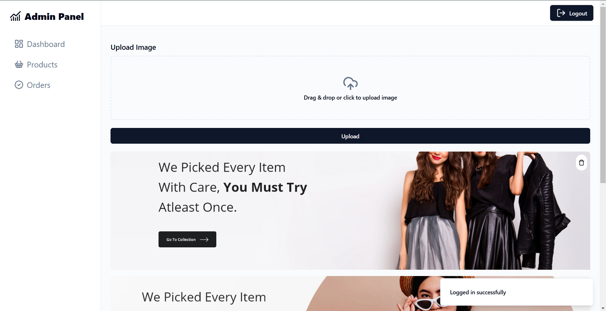
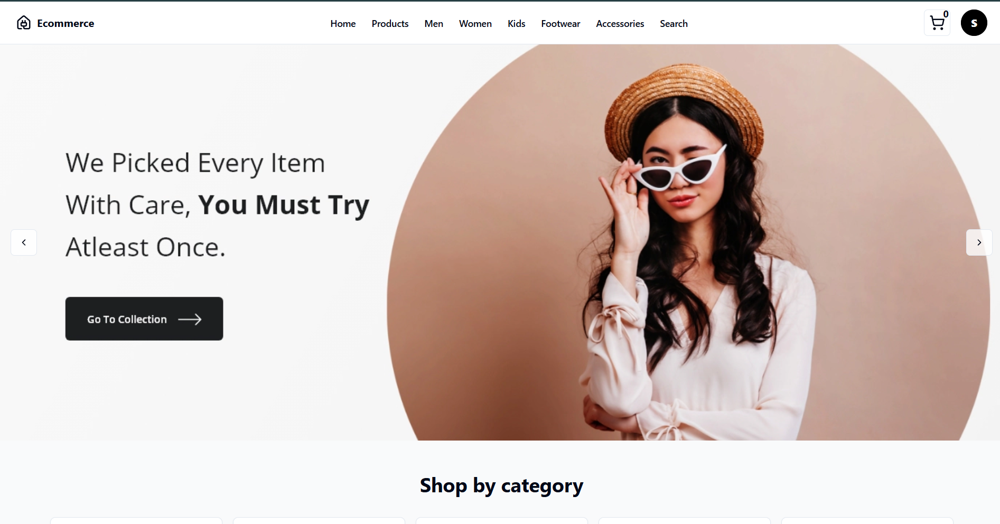
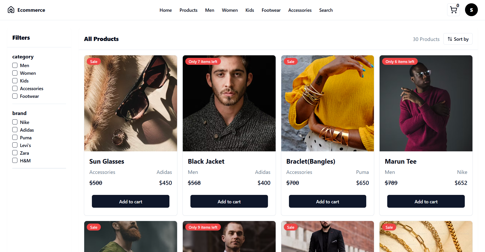

# E-Commerce Website with Admin Panel

Welcome to the **E-Commerce Website with Admin Panel** repository! This project is a fully functional online store with an integrated admin panel for managing products, orders, and users. The website allows customers to browse products, add items to the cart, and complete their purchase, while the admin panel provides easy-to-use tools for store management.

## Features

### User Features:
- **User Authentication**: Sign up, login, and manage user accounts.
- **Product Catalog**: Browse products by category, search, and filter.
- **Shopping Cart**: Add items to your cart and proceed to checkout.
- **Order Management**: View and track your orders.
- **Payment Integration**: Securely process payments via Paypal.
- **Responsive Design**: Optimized for mobile, tablet, and desktop devices.

### Admin Panel Features:
- **Dashboard**: View key metrics (e.g., total sales, active users).
- **Product Management**: Add, update, and delete products.
- **Order Management**: View, update, and manage customer orders.
- **User Management**: View and manage user accounts.
- **Analytics**: Access to order history, user activities, and sales statistics.
- **Role-based Access Control**: Admin access restricted to authorized users only.

## Technologies Used

- **Frontend**: React, HTML, CSS, JavaScript,Tailwind CSS
- **Backend**: Node.js, Express
- **Database**: MongoDB
- **Authentication**: JWT (JSON Web Tokens) for user authentication
- **Payment Gateway**:  PayPal 
- **Admin Panel**: React-based Admin Panel 
- **Deployment**: Vercel

## Installation

 **Install frontend dependencies**:
      cd frontend
      npm install
  **Install backend dependencies**:   
      cd backend
      npm install

### Prerequisites

- Node.js (v14 or higher)
- MongoDB (or another database service you use)
- PayPal API keys (if you're integrating payments)
- Admin access credentials for the admin panel

### Steps to Run Locally

1. Clone the repository to your local machine:
   bash
   git clone https://github.com/srinumaragada/E-Commerce-Website.git

###  Set up environment variables:

Create a .env file in both the backend and frontend folders and add necessary API keys, database URL, and other secrets.
**Backend**
# Cloudinary Configuration
CLOUDINARY_CLOUD_NAME=your-cloudinary-cloud-name
CLOUDINARY_API_KEY=your-cloudinary-api-key
CLOUDINARY_SECRET_KEY=your-cloudinary-secret-key

# PayPal Configuration
PAYPAL_CLIENT_ID=your-paypal-client-id
PAYPAL_CLIENT_SECRET=your-paypal-client-secret
PAYPAL_RETURN_URL_DEV=your-paypal-return-url-dev
PAYPAL_CANCEL_URL_DEV=your-paypal-cancel-url-dev
PAYPAL_RETURN_URL_PROD=your-paypal-return-url-prod
PAYPAL_CANCEL_URL_PROD=your-paypal-cancel-url-prod

# MongoDB Connection String
CONN_STR=your-mongodb-connection-string

# Server Configuration
PORT=5000
MODE=development

**FrontEnd**

VITE_API_URL_DEV=http://localhost:5000
VITE_API_URL_PROD=<your-production-url>

**Run the project**:
Start the backend server:
    cd backend
    npm run dev
    
Start the frontend server:
    cd frontend
    npm run dev

# Open your browser and visit http://localhost:5173 to view the website.
# For Admin Panel access, visit http://localhost:5173/admin (or the appropriate URL depending on your routing) and update the role as admin in your databse to access.

## Demo

Check out the live demo of the e-commerce website here:  
[Live Demo](https://e-commerce-frontend-ten-phi.vercel.app)

## Screenshots

### Admin Panel

### Home Page

### Products Page

### Contributing
If you'd like to contribute to this project, feel free to fork the repository, make changes, and submit a pull request. Contributions are always welcome!

### Steps to Contribute:
Fork this repository.
Create a new branch (git checkout -b feature-branch).
Make your changes and commit them (git commit -m 'Add new feature').
Push your changes (git push origin feature-branch).
Create a pull request.

### License
This project is licensed under the MIT License - see the LICENSE file for details.

### Acknowledgements
Paypal for payment gateway integration.
React for building the frontend and admin panel.
Node.js and Express for building the backend.
MongoDB for the database.
